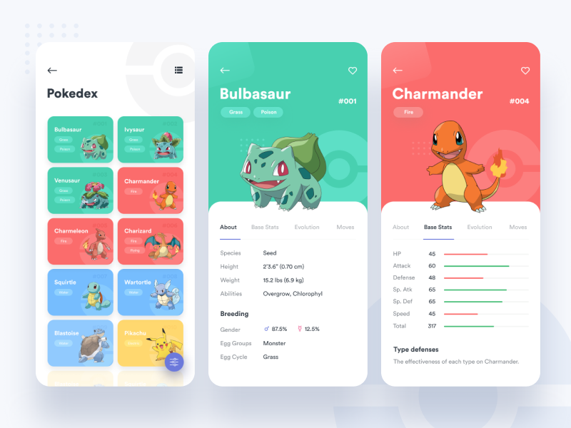

# Pokedex 

Projeto feito no curso da Dio "Criando um Projeto com HTML/CSS para Listagem de Pokémon" do bootcamp Coding The Future Banco PAN - Desenvolvimento Frontend com Angula.

Nesse projeto a utilizamos uma API para ser específico o método GET da  [Pokeapi](https://pokeapi.co/ ), além  de um design responsivo usando display  flex e grid 

## Layout foi baseado nesse design 

Instagram do criador dos design: [@saepulnahwan](https://www.instagram.com/saepulnahwan/)

## Tecnologia utilizadas
- HTML 
- CSS
- JS 

## Informações adicionais 
Data de finalização do projeto seguindo o curso: 
**01/01/2024**

Pretendo continuar esse projeto e colocar a minha personalidade nele a medida que eu for estudando.

### Em breve 
- filtro
- pesquisa id ou nome 
- página de detalhes pokemon
## ... ##

